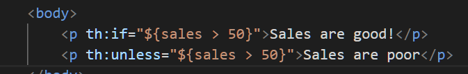

# The Complete Spring Boot Development Bootcamp

Notice the spring-boot-devtools dependency which speeds up development by ensuring the maven project is rebuilt whenever there are changes.

62. The MVC Design

- View - what the user sees
- Model - represents the data needed by the view
- Controller - allows the view and model to interact
  - responds to requests by managing Model and presenting view

63. The Controller

    
  - The class annotated with @Controller is an entry point for web requests
  - the controller maps the request to a handler method that matches the path
  - the handler method tries responding with a view called "somehtmlview"
    - actually looks inside the templates folder for somehtmlview, but there is nothing so an error code is returned.

70. The Model

- Download Java Code Generators extension for vs code
- We create a Grade.java class with three fields and generate all the constructors and getters and setters with this extension
- 

75. Thymeleaf: Combining Model and View

**Variable Expression**

- prefixed by $
- executes on a model attribute
- eg. `${age}`

- Make sure there are public getters for the needed attributes or thymeleaf will not be able to read them

76. **Selection expression**

`th:object` binds an object to the element

Then selection expressions (prefixed by star) can select attributes from the previously bound object.

78. Thymeleaf conditionals

`th:if` will render if condition is true

`th:unless` will not render unless condition is true

Alternatively, you can use conditionals in `th:text`

`th:switch`

80. Utility methods

## Cheatsheet from model view controller section

https://www.learnthepart.com/course/af54547f-e993-47bd-ad51-d7c7270c4e50/9996e227-3402-4553-9009-dfbdbe1d5d64

## Challenge 2

### Flash Attributes - data that survives a redirect

https://www.learnthepart.com/course/af54547f-e993-47bd-ad51-d7c7270c4e50/84f77423-b012-4ba3-bc90-6f2b2625ef49

## Three layer architecture

How to refactor our Controller to a Repository class

- All CRUD (create read update delete) operations should only occur inside the repository
- Strip all CRUD operations from the Controller class

How to refactor our Controller to a Service class

- Service must act as a middleman between Controller and Repository
- Controller should not interact with Repository directly
- Move every business operation from Controller into Service

154. REST API: Getting Started

- @ConditionalOnProperty

155.

- @GetMapping
- @Controller + @ResponseBody
  - @ResponseBody serializes an object to JSON
- @RestController
- Not that you can just annotate controller as @RestController instead of adding @Controller and @ResponseBody
- 
- Equivalent:
- Also equivalent:

## @RequestParam vs @PathVariable

Both are used to extract values from the request

@PathVariable is more suitable for REST. See docs. https://docs.spring.io/spring-framework/docs/3.0.0.M3/reference/html/ch18s02.html